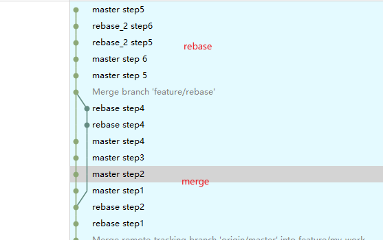

## 这是一个测试git使用的项目

### 一、将本地项目推送至仓库

> 1、本地获取ssh key  
> 2、将ssh key配置至github  
> 3、github上创建仓库获取  [git@github.com:wangxudream/git-demo.git]  
> 4、本地创建git管理的项目 commit 本地内容   
> 5、关联本地仓库和远程仓库  
> 6、推送本地仓库

```shell
    #生成ssh key 将公钥复制到github上 C盘 .ssh 文件夹内
    ssh-keygen -t rsa -C "youremail@example.com"
    #本地创建仓库和分支 commit
    git innit 
    git branch -m master
    git add .
    git commit -m 'first commit' 
    #关联本地仓库和远程仓库
    git remote add origin git@github.com:wangxudream/git-demo.git
    #将内容推送至远端仓库 
    git push -u origin master 
```

```text
origin是默认的远端仓库的名称
clone时可以自定义远程仓库的名称
git clone -o {name} http 

```

### 二、标签的使用

```shell
git tag -a 'v0.0.1' -m 'first tag' #本地创建标签
git push origin {tag_name} #本地标签推送至远端
git push origin --tags  # 将本地所有标签推送至远程仓库
git pull #可以获取本地没有的标签
git fetch origin tag {tag_name}
git push origin -d tag 'v0.0.1' #删除远程仓库中的tag
git ls-remote --tags origin # 查看远端分支tag
```

### 三、分支的使用

```shell
git push origin branch_name # 将分支推送至远程仓库
git push origin -d branch_name # 删除远程仓库分支
git branch -vv #查看分支的追踪关系
```
### 四、merge rebase

```text
merge
  merge 操作会生成新的commit点[Merge branch 'feature/rebase']
rebase
  rebase 操作会直接合并进去
  log操作看起来是一条直线
```