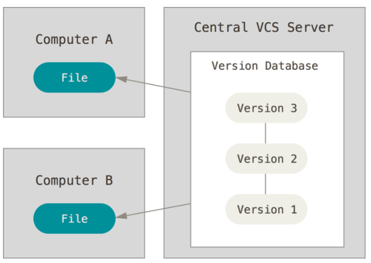
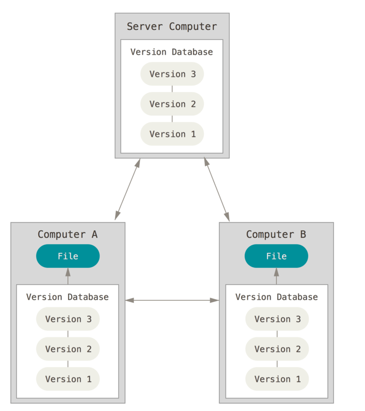
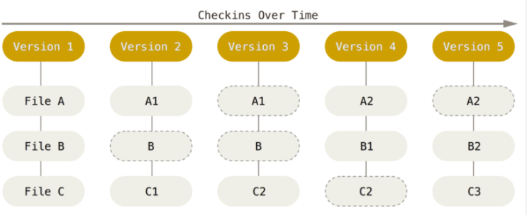
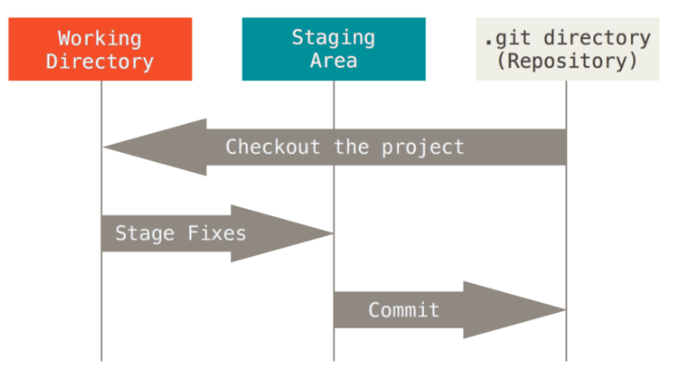

## Git笔记

### VCS CVCS DVCS

```text
VCS版本控制
CVCS 中央版本控制
  中央服务器的单点故障
DVCS 分布式版本控制
  每个客户端都保存有完整的镜像
```

CVS 中央版本控制

DCVS 分布式版本控制


### Git介绍

```text
Git处理数据的方式像一个快照流
Git近乎所有的操作都是本地完成
Git保证完整性
  通过SHA-1 散列
```

Git版本控制

Git仓库

```text
Git 有三种状态
  已提交(committed)、已修改(modified)和已暂存(staged)
  已提交表示数据已经安全的保存在本地数据库中。 
  已修改表示修改了文件，但还没保存到数据库中。 
  已暂存表示对一个已修改文件的当前版本做了标记，使之包含在下次提交的快照中。
```



### Git使用

#### config

```text
git的配置文件存储在三个不同的位置
/etc/gitconfig       #包含系统上每一个用户及他们仓库的通用配置 --system
~/.gitconfig
~/.config/git/config #只针对当前用户  --global
当前项目.git/config    #针对该仓库
```

```text
git config user.name {user_name}
git config --global user.name  {user_name} #设置当前用户姓名
git config --global user.email {user_email}
git config --global --get user.name
```

#### 一、将本地项目推送至仓库

> 1、本地获取ssh key  
> 2、将ssh key配置至github  
> 3、github上创建仓库获取  [git@github.com:wangxudream/git-demo.git]  
> 4、本地创建git管理的项目 commit 本地内容   
> 5、关联本地仓库和远程仓库  
> 6、推送本地仓库

```shell
    #生成ssh key 将公钥复制到github上 C盘 .ssh 文件夹内
    ssh-keygen -t rsa -C "youremail@example.com"
    #本地创建仓库和分支 commit
    git init 
    git branch -m master
    git add .
    git commit -m 'first commit' 
    #关联本地仓库和远程仓库
    git remote add origin git@github.com:wangxudream/git-demo.git
    #将内容推送至远端仓库 
    git push -u origin master 
```

```text
origin是默认的远端仓库的名称
clone时可以自定义远程仓库的名称
git clone -o {name} http 

```

#### 二、标签的使用[tag]

```shell
git tag -a 'v0.0.1' -m 'first tag' #本地创建标签
git push origin {tag_name} #本地标签推送至远端
git push origin --tags  # 将本地所有标签推送至远程仓库
git pull #可以获取本地没有的标签
git fetch origin tag {tag_name}
git push origin -d tag 'v0.0.1' #删除远程仓库中的tag
git push origin :{tag_name} #删除远程仓库中的tag
git ls-remote --tags origin # 查看远端分支tag
```

#### 三、分支的使用[branch]

```shell
git branch #查看本地分支
git branch -r #查看远端分支
git branch -a #查看所有分支
git branch {branch_name} #创建分支
git branch -d {branch_name} #删除分支
git branch -m {old_branch_name} {new_branch_name} #调整分支名称
git push origin {branch_name} # 将分支推送至远程仓库
git push origin -d {branch_name} # 删除远程仓库分支
git branch -vv #查看分支的追踪关系
```

#### 四、日志[log]

```text
git log  #显示提交日志信息
git show #查看日志 能查看具体变更
```

#### 四、merge rebase


```text
merge
  merge 操作会生成新的commit点[Merge branch 'feature/rebase']
rebase
  rebase 操作会直接合并进去
  log 操作看起来是一条直线
```

#### 五、pull fetch

```text
git pull = git fetch + git merge
使用
1、git fetch {远程仓库名} {分支名}
2、git log -p FETCH_HEAD
3、git merge FETCH_HEAD
从远端仓库取回更新后，会返回FETCH_HEAD，指的是某个branch在服务器上的最新状态，
我们可以在本地通过它查看刚取回的更新信息
```

